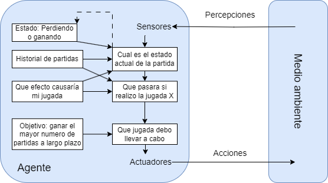

# RPS

En este proyecto hago uso del conocimiento que tengo en desarrollo en Java para aplicar un sistema de motores con el cual generar las acciones de la maquina. Estos motores heredarán de una misma clase abstracta usando la libreria Abstract Base Class de Python.

A continuación se explica el funcionamiento de los distintos motores:
- **ActionEngine**: Clase abstracta de la que heredan el resto de motores. Cuenta con un metodo con el decorador *@abstractmethod* llamado *generate_action()*. Este decorador obliga a que las clases que hereden de **ActionEngine** tengan que implementar el metodo.

- **RandomEngine**: Motor que genera acciones de manera aleatoria.

- **TenMovesEngine**: Motor que generá acciones utilizando como referencia la accion mas usada por el usuario en sus 10 ultimas jugadas.

- **PreviousMoveEngine**: Motor que generá acciones utilizando como referencia la ultima accion usada por el usuario.

- **PredictiveEngine**: Motor que generá acciones intentando detectar patrones en las jugadas del usuario. (Motor predeterminado)

## Contorno de tareas 

Contorno de tareas | Observable| Agentes | Determinista | Episódico | Estático | Discreto | Conocido
:---: | :---: | :---: | :---: | :---: | :---: | :---: | :---: |
 RPS | Parcialmente | Multiagente | Estocástico | Secuencial | Estático |  Discreto |  Conocido |

 Explicación de las características elegidas:

- **Observable**: Parcialmente, ya que no podemos saber qué está pensando el otro jugador.

- **Agentes**: Multiagente, ya que el juego cuenta con varios jugadores.

- **Determinista**: Estocástico, ya que no podemos predecir el movimiento del otro jugador de manera exacta.

- **Episódico**: Secuencial, ya que las anteriores partidas pueden utilizarse para determinar una jugada futura.

- **Estático**: Estático, ya que el entorno no cambia con el paso del tiempo.

- **Discreto**: Discreto, ya que la acción toma lugar en un único momento pasando de un estado a otro.

- **Conocido**: Conocido, ya que tienes conocimiento sobre las reglas por las que se rige el juego

## Estrutura del agente

El modelo elegido es el de agente basado en objetivos.

## Webgrafía

- **Apuntes de clase de Programación de Inteligencia Artificial**

- https://medium.com/@sri.hartini/-rock-paper-scissors-in-python-5173ab69ca7a

- https://ellibrodepython.com/abstract-base-class

- https://ellibrodepython.com/herencia-en-python